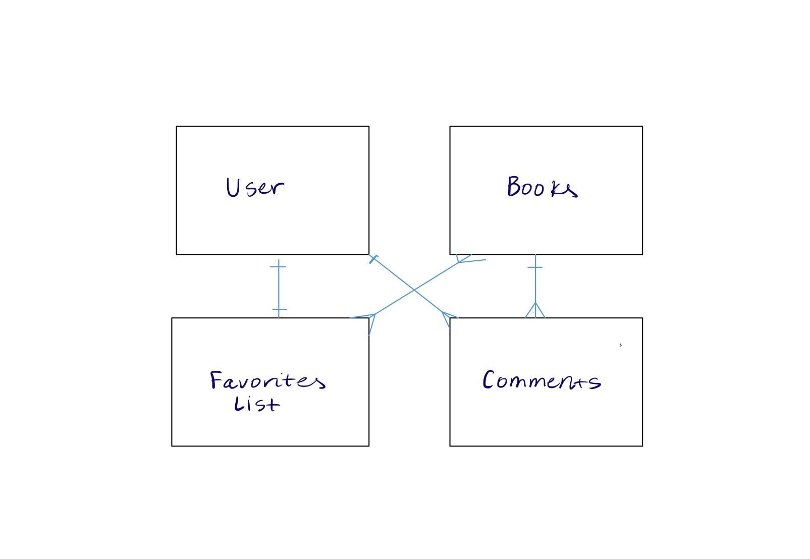

# Project 3 - Book Nook
A platform for book-lovers to browse, favorite, and add books. Users can like and comment on individual books allowing for intellectual discourse. Every month, registered users will have access to a book club, with thought-provoking questions to guide their reading. Overall, Book Nook is an all-in-one resource any reader would love.

## User Stories
#### Registered user
##### Sign in/out, account information routes
* As a registered user, I want to be able to sign in
* As a registered user, I want to be able to sign out
* As a registered user, I want to be able to change my password

##### All books
* As a registered user, I expect to view a list of books
* As a registered user, I expect to be able to click on a book and see more info and comments/reviews
* As a registered user, I want to be able to search for a book by title (and author?)
* As a registered user, I want to be able to add a book
* As a registered user, I want to be able to update a book I own
* As a registered user, I want to be able to delete a book I own
* As a registered user, I want to be able to filter by genre

##### Favorite Books
* As a registered user, I want to be able to be able to add books to my favorite list

##### Comments
* As a registered user, I want to be able to add comments and likes to a book
* As a registered user, I want to be able to delete comments I own
* As a registered user, I want to be able to update comments I own

##### Book Club - stretch
* As a registered user, I want to be able to see the book club book
* As a registered user, I want to be able to answer questions on the book club book page

#### Unregistered user
* As a unregistered user, I want to be able to sign up/create account
* As a unregistered user, I expect to view a list of books
* As a unregistered user, I expect to be able to click on a book and see more info and comments/reviews
* As a unregistered user, I want to be able to search for a book
* As a unregistered user, I want to be able to see the book club book

## Wireframes

## ERD

## API
#### Google Books API

## Routes
### User Routes
| Route           | Description |
|------------------------|-------------------|
| `/sign-up`             | create account  |
| `/sign-in`             | sign into account   |
| `/change-password/` | change password  |
| `/sign-out/`        | signout  |

### Book Routes
| Route          | Description |
|------------------------|-------------------|
| `/books`             | books index page   |
|`/books/:id`             | books show page   |
| `/newBook`             | new book  |
| `/books/:id/edit` | update a book  |

### Comment Routes
| Route          | Description |
|------------------------|-------------------|
|`/books/:id`             | add, edit, and delete comments on book's page |

### Favorites Routes
| Route          | Description |
|------------------------|-------------------|
|`/favorites`             | favorites index page|

## Roles

